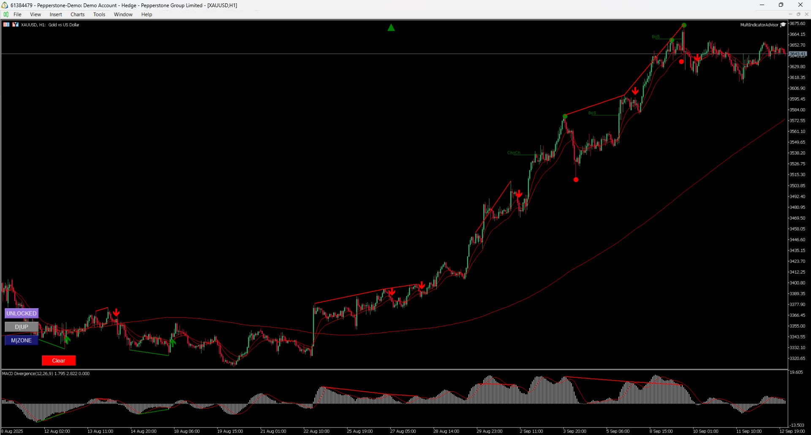

# MultiIndicatorAdvisor

A comprehensive MetaTrader 5 Expert Advisor that combines multiple technical indicators to generate trading signals and execute automated trades.



## Overview

MultiIndicatorAdvisor is a sophisticated trading system that integrates various technical analysis indicators including MACD, RSI, Smart Money Concepts (SMC), Doji patterns, Central Pivot Range (CPR), and Moving Averages to provide robust trading signals. The EA is designed to work across multiple timeframes and provides both alert and automated trading capabilities.

## Features

### Technical Indicators Integration
- **MACD Divergence Indicator**: Detects MACD crossovers and divergences
- **RSI Divergence Indicator**: Identifies RSI overbought/oversold conditions and divergences
- **Smart Money Concepts (SMC)**: Analyzes market structure, order blocks, and break of structure
- **Doji Pattern Detection**: Identifies potential reversal patterns
- **Central Pivot Range (CPR)**: Provides key support and resistance levels
- **Moving Averages**: Multiple timeframe trend analysis with SMA and EMA

### Trading Features
- **Multi-timeframe Analysis**: Analyzes current and higher timeframes simultaneously
- **Automated Trade Management**: Handles position sizing, stop loss, and take profit
- **Risk Management**: Configurable stop loss and profit targets
- **Signal Confluence**: Requires multiple indicator confirmations before trading
- **Alert System**: Popup alerts and notifications for trading opportunities
- **Analytics Export**: CSV export of trading data and indicator values

### Chart Customization
- **Dark Theme**: Professional black background with colored candlesticks
- **Visual Indicators**: Trend arrows and pattern markers
- **Customizable Colors**: Configurable indicator colors and styles

## Installation

1. **Download the EA files**:
   - `MultiIndicatorAdvisor.mq5` - Main Expert Advisor file
   - `MultiIndicatorAdvisor.ex5` - Compiled executable

2. **Install Required Indicators**:
   - MACD Divergence Indicator MT5.ex5
   - RSI Divergence Indicator MT5.ex5
   - SMCIndicator.ex5
   - Doji.ex5
   - Central Pivot Tool MT5.ex5

3. **Copy files to MetaTrader 5 directories**:
   - Place `.mq5` file in: `MQL5/Experts/`
   - Place `.ex5` file in: `MQL5/Experts/`
   - Place indicator files in: `MQL5/Indicators/`

4. **Compile the EA**:
   - Open MetaEditor
   - Open `MultiIndicatorAdvisor.mq5`
   - Press F7 to compile

## Configuration

### Basic Settings

```mql5
// Trading Configuration
bool Enable_EA_Trade = false;        // Enable automated trading
bool Enable_EA_Alert = true;         // Enable alerts
int Stoploss_Pips = 100;            // Stop loss in pips
int Profit_Ratio = 6;               // Risk-reward ratio
double Lot_Size = 0.1;              // Position size
```

### Indicator Settings

#### MACD Configuration
```mql5
bool Enable_Macd = true;                    // Enable MACD analysis
int MACD_FAST_EMA_PERIOD = 12;             // Fast EMA period
int MACD_SLOW_EMA_PERIOD = 26;             // Slow EMA period
int MACD_SIGNAL_SMA_PERIOD = 9;            // Signal line period
double Macd_Overflow = 0.5;                // Overflow threshold
```

#### RSI Configuration
```mql5
bool Enable_Rsi = false;                   // Enable RSI analysis
double Rsi_Overflow_Low = 20;              // Oversold level
double Rsi_Overflow_High = 80;             // Overbought level
int RSI_PERIOD = 14;                       // RSI period
```

#### SMC Configuration
```mql5
bool Enable_Smc = true;                    // Enable SMC analysis
ENUM_TIMEFRAMES Smc_Lower_Timeframe = PERIOD_CURRENT;
ENUM_TIMEFRAMES Smc_Higher_Timeframe = PERIOD_M30;
int SMC_CHOCH_CONFORMATION = 16;           // Change of character confirmation
int SMC_OB_BREAKOUT = 4;                   // Order block breakout
```

#### Moving Averages
```mql5
int Ma_Period_Lt = 10;                     // Short-term MA period
int Ma_Period_Mt = 21;                     // Medium-term MA period
int Ma_Period_Ht = 240;                    // Long-term MA period
int Bars_To_Check = 100;                   // Bars for trend analysis
double Slope_Threshold = 0.0;              // Trend slope threshold
```

## Trading Logic

### Signal Generation
The EA generates trading signals based on the confluence of multiple indicators:

1. **Trend Detection**: Uses moving average crossovers and slope analysis
2. **MACD Signals**: Crossover and divergence detection
3. **RSI Signals**: Overbought/oversold conditions and divergences
4. **SMC Analysis**: Market structure and order block analysis
5. **Doji Patterns**: Reversal pattern confirmation

### Entry Conditions
- **Buy Signal**: Requires bearish MA crossover + uptrend + MACD confirmation
- **Sell Signal**: Requires bullish MA crossover + downtrend + MACD confirmation
- **Signal Threshold**: Minimum 2 MACD crossover signals required

### Risk Management
- **Stop Loss**: Configurable in pips from recent high/low
- **Take Profit**: Based on risk-reward ratio (default 1:6)
- **Position Sizing**: Fixed lot size with optional adjustment factor
- **Trade Management**: Closes opposite positions before opening new ones

## Usage

### Manual Trading (Alerts Only)
1. Set `Enable_EA_Trade = false`
2. Set `Enable_EA_Alert = true`
3. Attach EA to chart
4. Monitor alerts for trading opportunities

### Automated Trading
1. Set `Enable_EA_Trade = true`
2. Configure risk parameters
3. Ensure sufficient account balance
4. Monitor EA performance

### Backtesting
1. Use Strategy Tester in MetaTrader 5
2. Select appropriate date range
3. Configure test parameters
4. Review results and analytics

## Analytics and Reporting

The EA automatically exports trading data to CSV files:
- **Trade Results**: `{Symbol}_{Timeframe}_TEST_RESULT.csv`
- **Analytics Data**: `{Symbol}_{Timeframe}_ANALYTICS.csv`

Analytics include:
- Position details and performance
- Indicator values at trade entry
- Market structure analysis
- Risk metrics

## Requirements

### MetaTrader 5
- MetaTrader 5 platform
- MQL5 programming environment
- Live or demo trading account

### Required Indicators
- MACD Divergence Indicator MT5.ex5
- RSI Divergence Indicator MT5.ex5
- SMCIndicator.ex5
- Doji.ex5
- Central Pivot Tool MT5.ex5

### System Requirements
- Windows 7/8/10/11
- Minimum 4GB RAM
- Stable internet connection
- VPS recommended for 24/7 trading

## Risk Disclaimer

**IMPORTANT**: This Expert Advisor is for educational and research purposes. Trading involves substantial risk of loss and is not suitable for all investors. Past performance does not guarantee future results. Always:

- Test thoroughly on demo accounts
- Start with small position sizes
- Monitor performance regularly
- Understand the risks involved
- Consider your risk tolerance

## Support and Updates

For support, bug reports, or feature requests:
- Check the code comments for configuration options
- Review the analytics output for performance insights
- Test on demo accounts before live trading

## License

Copyright © 2025 LesleyJJ. All rights reserved.

## Version History

- **v1.00**: Initial release with multi-indicator integration
  - MACD and RSI divergence detection
  - SMC market structure analysis
  - Doji pattern recognition
  - CPR pivot analysis
  - Multi-timeframe support
  - Automated trade management
  - Analytics and reporting

---

*This EA is designed for experienced traders who understand technical analysis and risk management principles. Always test thoroughly before live trading.*


**Note:** The full source code is not publicly available. If you are interested in accessing the source code or collaborating, please [contact me](mailto:jacobjohnlesley@gmail.com).
